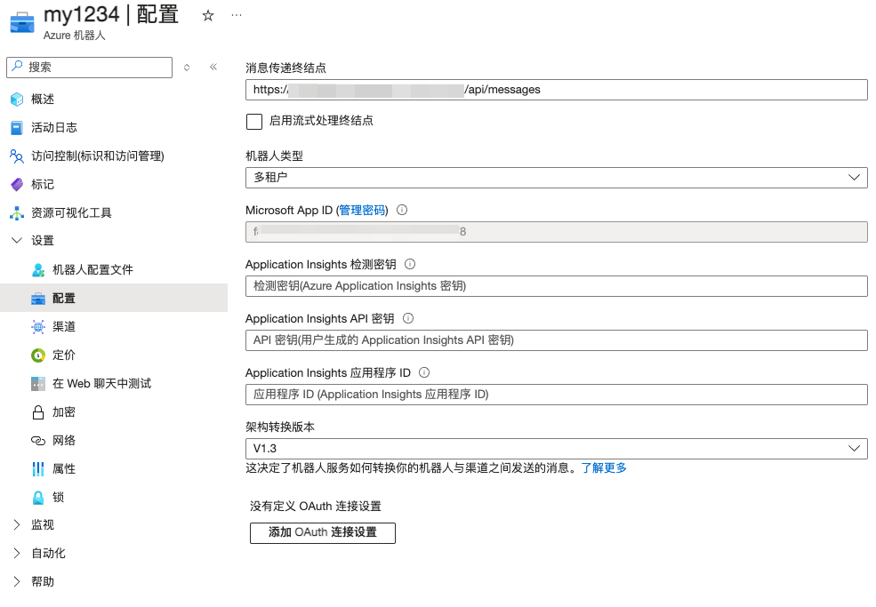
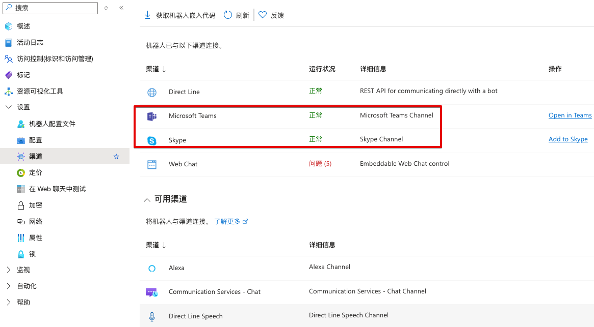

此项目基于[16.proactive-messages](https://github.com/microsoft/BotBuilder-Samples/tree/main/samples/python/16.proactive-messages)

在原项目基础上添加了以下几个功能
1. 长期保存用户记录，方便服务重启后仍然能给之前的用户发消息
2. 输入 "myid" 返回用户 ID

## 部署

```bash
git clone https://github.com/johe123qwe/teamsbot.git
```

创建并进入 Python 虚拟环境

```bash
python3 -m venv .venv
source .venv/bin/activate
```

安装依赖

```bash
pip install -r requirements.txt
```

### 创建 Azure 机器人

1. [注册一个 azure 帐号](https://portal.azure.com/#home)
2. 搜索 azure bot，创建一个机器人 
3. 在配置里为“消息传递终结点”添加一个域名 
4. 在“渠道”中添加 ”Microsoft Teams“ 和 ”Skype 

修改配置文件
```bash
mv config-example.py config.py
```
填写以下参数
- MicrosoftAppId
- MicrosoftAppPassword
- MicrosoftAppTenantId

## 启动

```bash
python app.py
```

机器人的链接为 https://join.skype.com/bot/MicrosoftAppId 把 MicrosoftAppId 替换为实际的 ID，之后可以与机器人对话。

## 使用说明

给所有用户发消息
```bash
curl -X POST https://YOURURL/api/notify \
     -H "Content-Type: application/json" \
     -d '{"message": "Hello, this is a message!"}'
```

给特定用户发消息
```bash
curl -X POST https://YOURURL/api/send-message \
     -H "Content-Type: application/json" \
     -d '{"message": "Hello, this is a custom message!", "user_id": "29:1WYxtJrpFKliDr"}'
```
- user_id：通过给机器人发送 ”myid“ 获取 ID 号

通过对话ID发消息
```bash
curl -X POST https://YOURURL/api/send-by-convid \
     -H "Content-Type: application/json" \
     -d '{"message": "Hello, this is a custom message!", "conversation_id": "19:6f566893c2c03400cb8"}'
```
- conversation_id：通过给机器人发送 ”convid“ 获取 ID 号，在群组里需要@机器人

[BotBuilder-README](https://github.com/microsoft/BotBuilder-Samples/blob/main/README.md)